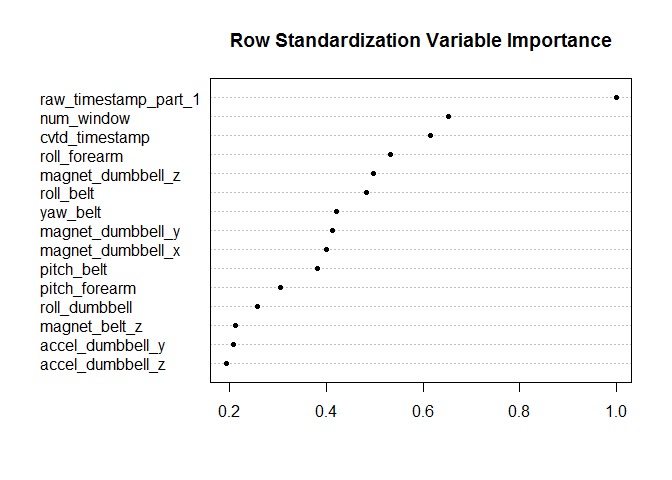
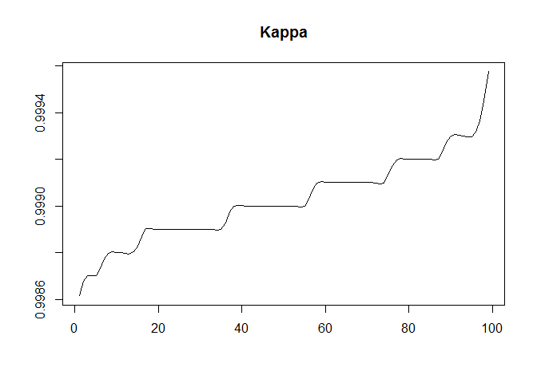

Machine Learning Project: Prediction Assignment Writeup
================
Martin Haneferd
21 jan. 2017

Overview
========

The goal of this project is to predict 20 occurences of correctly and incorrectly barebell lifting excercises. There are two datasets (training and testing) that was provided to find the right model for prediction. The dataset's are provided by Velloso, E.; Bulling, A.; Gellersen, H.; Ugulino, W.; Fuks, H. Qualitative Activity Recognition of Weight Lifting Exercises. Read more: <http://groupware.les.inf.puc-rio.br/har#ixzz4VrFz3TdU>

The data collection in the datasets was done by use of data from accelerometers on the belt, forearm, arm, and dumbell. The "classe" variable in the training set is the dependent variable that needs to be predicted in the test dataset at the end.

Management summary
------------------

To be able to predict 20 occurences with 100% accuracy, the model need to be extremly accurate. I was therefore creating a training and test set out of the training dataset. I used Random forest to create a model The final model got an accuracy over 99%. This is good enough to predict the 20 values in test set. And it "thankfully" matched the Quiz-answers 100%.

Load libraries
--------------

``` r
library(RCurl)
library(caret)
library(randomForest)
library(rfUtilities)
set.seed(1)
```

Data load
---------

Download and read the datasets.

``` r
# Get Training dataset
train_file <- "./pml-training.csv"
download.file("https://d396qusza40orc.cloudfront.net/predmachlearn/pml-training.csv", 
              destfile=train_file, method="libcurl")

# Get test dataset
test_file <- "./pml-testing.csv"
download.file("https://d396qusza40orc.cloudfront.net/predmachlearn/pml-testing.csv",
              destfile=test_file, method="libcurl")

# Read training and test dataset
dfTrain <- read.csv(train_file, na.strings=c("NA",""))
dfTest <- read.csv(test_file, na.strings=c("NA",""))
```

Data Exploration and Preparation
--------------------------------

Since there are some unneccesarry variables, and a huge amount of missing data (NA's), I will remove these columns to be able to compute randomforest.

``` r
# Look at datasets
dim(dfTrain)
```

    ## [1] 19622   160

``` r
dim(dfTest)
```

    ## [1]  20 160

``` r
#str(dfTrain) -> Have commented it out since it produced a lot of output.

# Remove the index
dfTrain <- dfTrain[,-1] 

# Remove the columns that have over 70% missing data/values
numcol <- ncol(dfTrain)
numrow <- nrow(dfTrain)
colsWithData <- c( colSums( !is.na( dfTrain[,-numcol] ) ) >= 0.7 * numrow ) # True if data.
dfTrain <- dfTrain[,colsWithData] # Only keep the columns with data

# convert the timestamps from factor to datetime
dfTrain$cvtd_timestamp <- as.POSIXlt(as.character(dfTrain$cvtd_timestamp), format="%d/%m/%Y %H:%M")
dfTest$cvtd_timestamp <- as.POSIXlt(as.character(dfTest$cvtd_timestamp), format="%d/%m/%Y %H:%M")

dim(dfTrain) # See the dimensions of the dataset.
```

    ## [1] 19622    59

I use the random forest utillity package to select the important variables/features to build the model

``` r
# Find the important features in the datasets.
rf.class <- rf.modelSel(dfTrain[,1:58], dfTrain[,"classe"], ntree = 100)

# importance of selected features
plot(rf.class) 
```



``` r
# Put the important features in a variable.
vars <- rf.class$selvars

length(vars) # Look at the number of variables left
```

    ## [1] 15

``` r
dfTrain <- dfTrain[,c(vars,"classe")]
dfTest <- dfTest[,vars]
```

Split the training dataset into two datasets: training (80%) and testing (20%)

``` r
inTrain <- createDataPartition(y = dfTrain$classe, p = .80, list = FALSE)
training <- dfTrain[ inTrain,]
testing <- dfTrain[-inTrain,]

# Check the sizes of the training and test set.
dim(training)
```

    ## [1] 15699    16

``` r
dim(testing)
```

    ## [1] 3923   16

Perform prediction modelling
----------------------------

I use random forest to fit the model.

``` r
# Build the Random forest model
rf.mdl <- randomForest(training[,vars], 
                       training[,"classe"], 
                       importance = TRUE)
```

Analyzing the model
-------------------

The model is analyzed with cross validation. The default values is 99 folds with 10% data withhold. The kappa and accuracy is then measured of the model. As you will see the kappa will be over 99% for both the model and cross validation of the model. The accuracy related to both sensitivity and specificity by each class is very good. There is no sign of overfitting.

``` r
# Do a cross validation on the model and look at Kappa for evaluating the classifiers.
rf.cv <- rf.crossValidation(rf.mdl, training[,vars])
plot(rf.cv, type = "cv", stat = "kappa")
```



``` r
# Investigate the accuracy provided by the cross validation of the model
summary(rf.cv)
```

    ## Classification accuracy for cross-validation 
    ##  
    ##                      A   B   C   D   E
    ## users.accuracy     100 100 100 100 100
    ## producers.accuracy 100 100 100 100 100
    ##  
    ## Cross-validation Kappa = 0.999 
    ## Cross-validation OOB Error = 0.000849317 
    ## Cross-validation error variance = 1.710056e-08 
    ##  
    ##  
    ## Classification accuracy for model 
    ##  
    ##                      A    B    C    D   E
    ## users.accuracy     100 99.9 99.8 99.9 100
    ## producers.accuracy 100 99.9 99.9 99.9 100
    ##  
    ## Model Kappa = 0.999 
    ## Model OOB Error = 0.000849317 
    ## Model error variance = 1.677512e-08

``` r
# Look at the accuracy of the model on the testing subset of the provided train dataset.
rf.testing.mdl <-  predict(rf.mdl, newdata=testing[,vars])
accuracy(rf.testing.mdl, testing$classe)
```

    ## Accuracy (PCC): 99.923527912312% 
    ## 
    ## Cohen's Kappa: 0.999 
    ## 
    ## Users accuracy: 
    ##     A     B     C     D     E 
    ## 100.0  99.7  99.9 100.0 100.0 
    ##  
    ## 
    ## Producers accuracy: 
    ##     A     B     C     D     E 
    ## 100.0  99.9  99.7 100.0 100.0 
    ##  
    ## 
    ## Confusion matrix 
    ##    y
    ## x      A    B    C    D    E
    ##   A 1116    0    0    0    0
    ##   B    0  757    1    0    0
    ##   C    0    2  683    0    0
    ##   D    0    0    0  643    0
    ##   E    0    0    0    0  721

``` r
# Confusion Matrix by Class only:
t(confusionMatrix(rf.testing.mdl,testing$classe)$byClass)
```

    ##                       Class: A  Class: B  Class: C  Class: D  Class: E
    ## Sensitivity          1.0000000 0.9973650 0.9985380 1.0000000 1.0000000
    ## Specificity          1.0000000 0.9996839 0.9993825 1.0000000 1.0000000
    ## Pos Pred Value       1.0000000 0.9986807 0.9970803 1.0000000 1.0000000
    ## Neg Pred Value       1.0000000 0.9993681 0.9996912 1.0000000 1.0000000
    ## Precision            1.0000000 0.9986807 0.9970803 1.0000000 1.0000000
    ## Recall               1.0000000 0.9973650 0.9985380 1.0000000 1.0000000
    ## F1                   1.0000000 0.9980224 0.9978086 1.0000000 1.0000000
    ## Prevalence           0.2844762 0.1934744 0.1743564 0.1639052 0.1837879
    ## Detection Rate       0.2844762 0.1929646 0.1741015 0.1639052 0.1837879
    ## Detection Prevalence 0.2844762 0.1932195 0.1746113 0.1639052 0.1837879
    ## Balanced Accuracy    1.0000000 0.9985244 0.9989603 1.0000000 1.0000000

Do final prediction
-------------------

``` r
# Use the model to predict the outcome of the provided test dataset
rf.final <- predict(rf.mdl, dfTest)
rf.final
```

    ##  1  2  3  4  5  6  7  8  9 10 11 12 13 14 15 16 17 18 19 20 
    ##  B  A  B  A  A  E  D  B  A  A  B  C  B  A  E  E  A  B  B  B 
    ## Levels: A B C D E

Summary
-------

The random forest model selection turns out to be extremly accurate. It is fast when you use the rfUtility package to select out the most important variables, and run the random forest with default values. The forecast turned out to be exact and gave 100% on the quiz.
